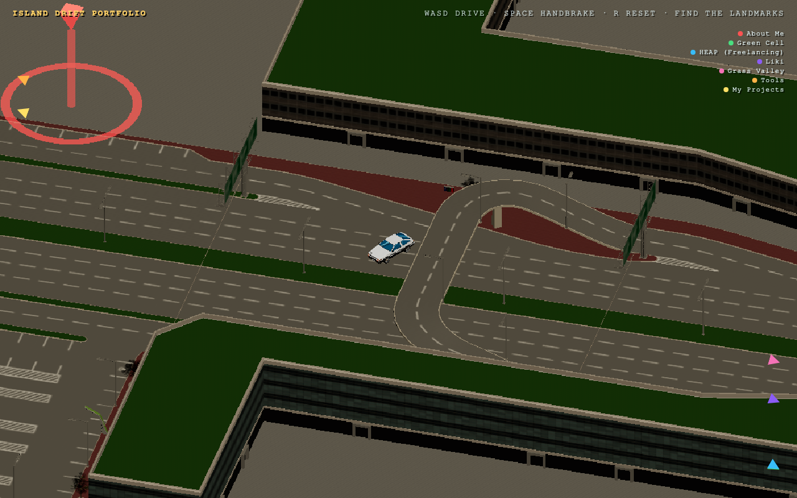

# Island Drift Portfolio

A drivable 3D portfolio. Instead of scrolling a page, you drive a low-poly
JDM car around an island, discovering "About Me", work experience, projects,
and skills as landmarks scattered across the map.

**Live:** https://sage-bombolone-e9f205.netlify.app/



## Controls

| Key             | Action                    |
| --------------- | ------------------------- |
| `W A S D`       | Drive                     |
| `Space`         | Handbrake (drift)         |
| `R`             | Reset to spawn            |

Drive close to a colored ring/beacon to open its info panel. Off-screen
landmarks show as colored arrows at the edge of the screen (see the legend,
top-right) and disappear once you can see the landmark itself.

## Tech stack

- [Three.js](https://threejs.org/) — 3D rendering
- [three-mesh-bvh](https://github.com/gkjohnson/three-mesh-bvh) — accelerated
  raycasting for ground/wall collision against the island mesh
- TypeScript + [Vite](https://vitejs.dev/)

## Getting started

Requires Node 18+.

```bash
npm install
npm run dev
```

Then open the printed `localhost` URL.

```bash
npm run build    # production build to dist/
npm run preview  # preview the production build locally
```

## Making it your own

All portfolio content — landmark titles, copy, links, and the (x, z) map
position of each stop — lives in one file:

```
src/game/PortfolioData.ts
```

Landmark positions are island world coordinates. The easiest way to find a
good spot for a new one is to temporarily flip `SHOW_COORDS` to `true` in
`src/game/Game.ts`, drive to the spot you want, and read the live x/z
readout off the HUD.

## Deployment

Deployed on [Netlify](https://netlify.com), connected directly to this GitHub
repo — every push to `main` triggers a new build and deploy automatically.
Build settings are in [`netlify.toml`](netlify.toml) (`npm run build`,
publishing `dist/`), which Netlify picks up as soon as the repo is imported
as a new site, no manual configuration needed.

## Credits

Third-party assets and their licenses are listed in [CREDITS.md](CREDITS.md).
